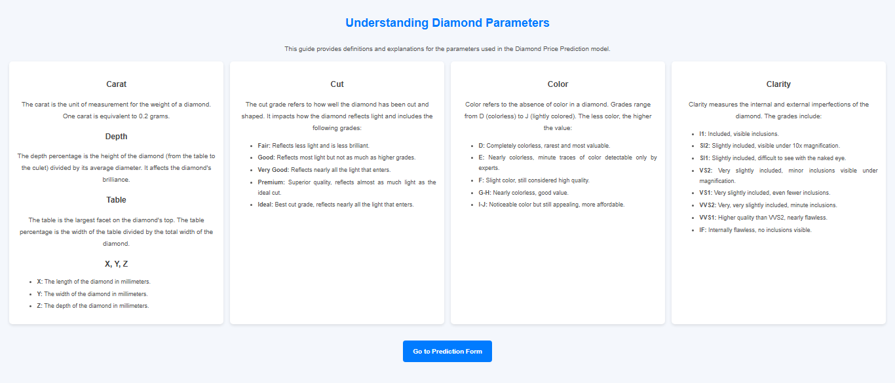
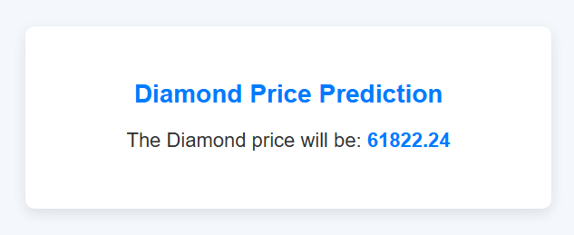

# Diamond Price Prediction

This project allows users to predict the price of a diamond based on key parameters such as carat, cut, color, clarity, depth, and dimensions (x, y, z). The project is built using Flask for the backend, HTML/CSS for the frontend, and a trained machine learning model for predictions.

---

## Table of Contents
- [Project Overview](#project-overview)
- [Features](#features)
- [Setup and Installation](#setup-and-installation)
- [Project Demo](#project-demo)
- [Contact](#contact)

---

## Project Overview

Diamonds are priced based on their unique characteristics, such as carat weight, cut quality, color grade, and clarity. Predicting the price of a diamond accurately requires understanding these parameters and leveraging a robust predictive model. This project simplifies this process by offering:

- **Parameter Definitions**: A detailed page explaining key diamond parameters to educate users.
- **Interactive Form**: A user-friendly form where users can input diamond characteristics.
- **Price Prediction**: A machine learning model predicts the diamond price based on the entered parameters.
- **Modern UI**: A responsive and visually appealing design using CSS3.

Whether you are a jeweler, gemologist, or a curious individual, this tool helps you estimate diamond prices efficiently.

---

## Features

- **Detailed Parameter Insights**: Includes an explanation page for all parameters used in the prediction model.
- **Seamless User Interaction**: Interactive forms for quick data entry.
- **Instant Predictions**: Provides real-time price estimates based on user input.
- **Customizable Design**: Built with HTML and CSS3 for a sleek and professional look.

---

## Dataset
[Dataset Link is Here....!](https://github.com/Yogesh3454/student_performance_prediction/blob/main/notebook/student.csv)

---

## Setup and Installation

To get started with this project locally, follow these steps:

### Prerequisites
Ensure the following software is installed on your system:
- **Python 3.8 or later**
- **pip** (Python package manager)

### Step 1: Clone the Repository
1. Open your terminal or command prompt.
2. Clone this repository using the following command:
   ```bash
   git clone https://github.com/your-username/diamond-price-prediction.git
   ```

### Step 2: Install Dependencies
Install the required Python libraries by running:
```bash
pip install -r requirements.txt
```
The requirements.txt file includes:
- flask==2.1.0
- scikit-learn==1.1.0
- numpy==1.23.0

### Step 3: Run the Application
Start the Flask server:

```bash
python app.py
```

Open your browser and visit:
```bash
http://127.0.0.1:8000
```
Use the application to explore parameters and predict diamond prices!

---

## Project Demo
Parameter Explanation Page
This page explains the diamond parameters used for price prediction.



**Users can input diamond details on this page.**

- **Before Prediction:**


- **After Prediction:**
Once the form is submitted, the predicted price is displayed.


---

## Project Workflow
**Parameter Explanation Page:**
Users visit the index.html page, which provides detailed information about the parameters used in diamond price prediction.

**User Input Form:**
On the form.html page, users input the diamond's characteristics (e.g., carat, cut, color, etc.) into the interactive form.

**Model Prediction:**
The data from the form is sent to the Flask backend, where a pre-trained machine learning model predicts the diamond's price.

**Result Display:**
The predicted pr**ice is displayed on the result page with a clean and informative UI.

**Iterative Use:**
Users can refine inputs and re-submit the form for updated predictions.

---

## Contact
If you have any questions, feel free to reach out:

[Email](yogeshgunjal75@gmail.com)
[LinkedIn]()

---

## License
This project is licensed under the MIT License.
You are free to use, modify, and distribute this project. See the LICENSE file for more details.
